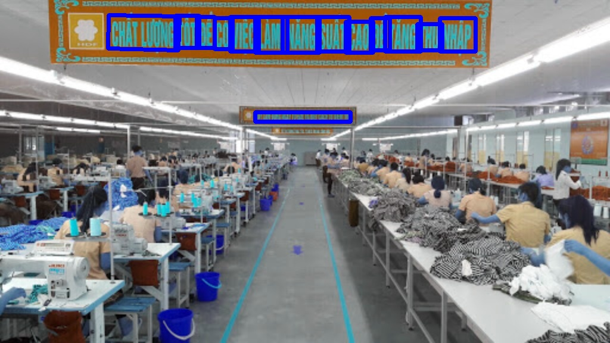
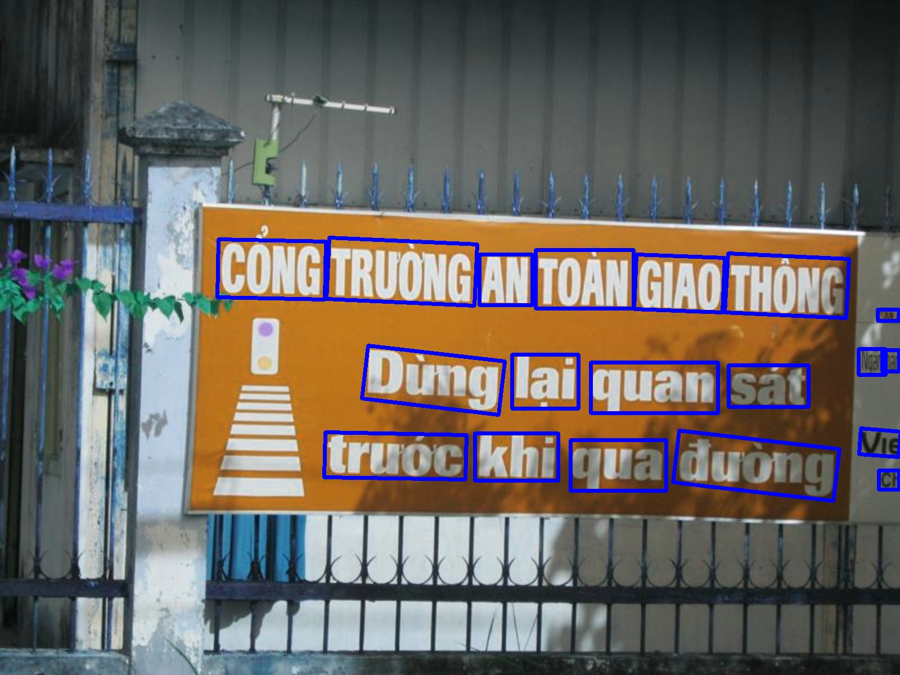
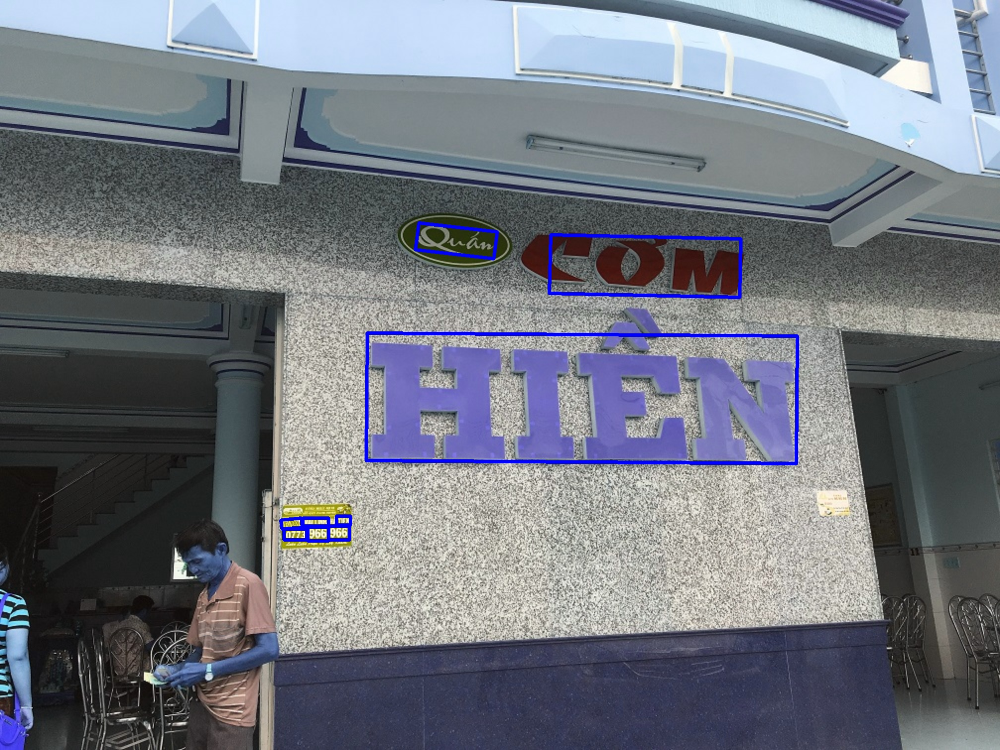

## Huấn luyện craft

Mô tả: Craft detection sẽ khoanh vùng nơi có các kí tự theo nhiều hình dạng khác nhau như hình vuông, hình chữ nhật hay hình cong bao quanh các cụm kí tự.

- Dữ liệu huấn luyện: VinAI
- Bài báo: [Read here ](https://arxiv.org/pdf/1904.01941.pdf)
- Code gốc: [Read here ](https://github.com/faustomorales/keras-ocr) 

## 1. Dữ liệu đầu vào gồm:
- Ảnh: Ảnh có đuôi .jpg và có kích cỡ không giới hạn, trong ảnh bao gồm các vùng văn bản để nhận diện
- Nhãn: Nhãn được ghi trong file .txt gồm 9 phần tử bao gồm: 8 phần tử số và phần tử chữ ở cuối được nhận diện sẽ được đánh dấu trong cặp dấu ngoặc kép(""), các phần tử cách nhau bằng dấu cách.

## 2. Để chạy thử mô hình ta chạy file sample.py

##3. Để kiểm tra độ chính xác mô hình ta chạy file accuuracy.py trong folder keras_ocr
    Độ chính xác của mô hình là 78.563%
## 3. Để huấn luyện mô hình ta chạy file main.py. Trong đó:
- `-l` là folder label, khi huấn luyện mô hình bạn thay đường dẫn folder label vào "default"
- `-i` là folder ảnh training, khi huấn luyện bạn thay đường dẫn folder ảnh vào "default" 
- `-cp` là đường dẫn mô hình khi training xong, bạn thay đường dẫn nơi bạn muốn để model và đặt tên cho model.
- `-b` là kích thước batch
- ` -l` là file CSV Logger, file tổng hợp các mất mát của mỗi epoch khi training, khi huấn luyện xong sẽ xuất ra file CSV Logger, bạn thay đường dẫn nơi bạn muốn lưu file CSV Logger
- `-e` là epoch, 1 epoch là 1 lần duyệt hết toàn bộ dữ liệu. Số epoch là số lần bạn muốn duyệt hết toàn bộ dữ liệu
- `-p` là patience, model sẽ dừng train khi tham số quan sát không khá lên sau N epochs
- `-r` là random_state có chức năng phân chia các tập dữ liệu kiểm tra và huấn luyện một cách ngẫu nhiên
- `-t` là train_size, với train_size = 0.8 mô hình sẽ chia bộ dữ liệu ra thành 2 phần với 80% dữ liệu để training và 20% dữ liệu để test

## 4. Example 

